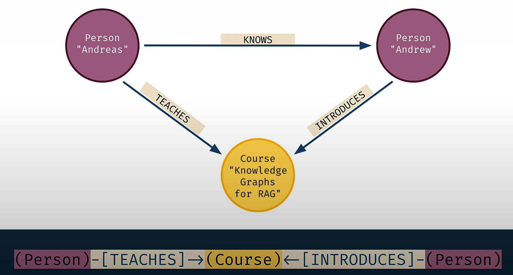
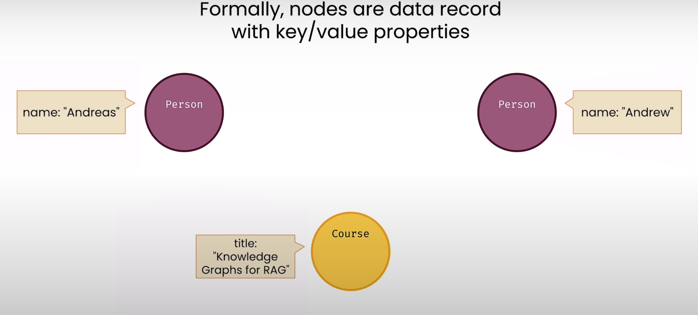
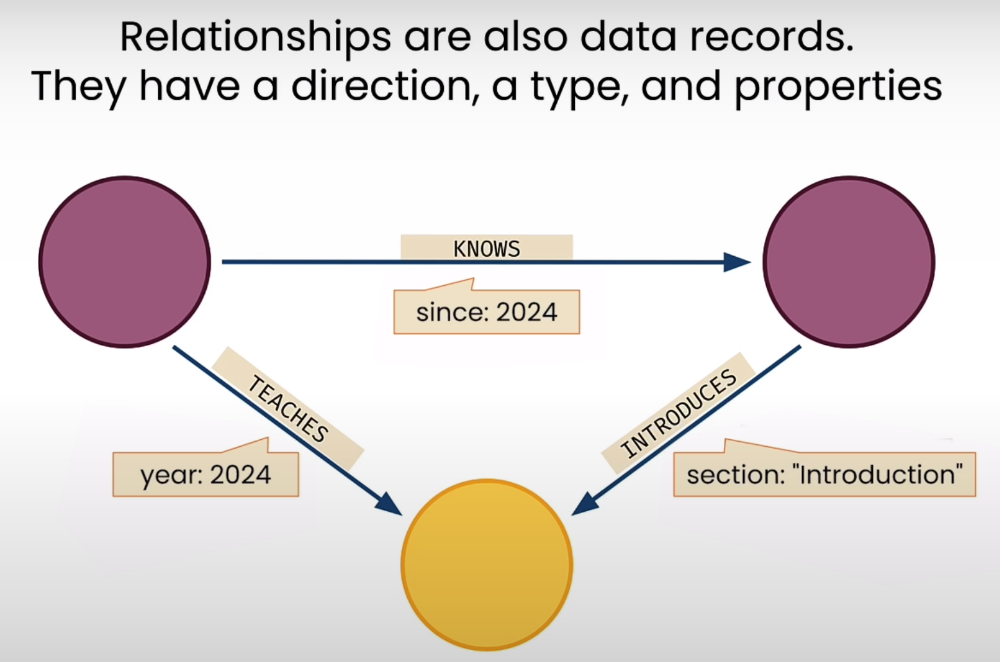

# Knowledge Graph Fundamentals

- Relationships *contain* two nodes
- Example
  - (PERSON)-[KNOWS]-(PERSON)
- The nodes are "in" a relationship, which itself has properties.
- In OO-perspective or even relational model, the entity would "know" each other with direct references or foreign keys.
- **Graph types are composable!**
- 
- Formally
  - Nodes have labels which is used for grouping.
  - Nodes are data record with key/value properties.
    
  - Relationships are also data records which have a direction, a type, and properties.
    
    - Type: KNOWS, TEACHES, INTRODUCES
    - Property: Mentioned below the Type for each relationship.

## What is a Knowledge Graph?

- Knowledge Graph: A database that stores information in **nodes** and **relationships**.
- Both nodes and relationships can have **properties**.
- Nodes can be given **labels** to group them together.
- Relationships always have a **type** and a **direction**.
