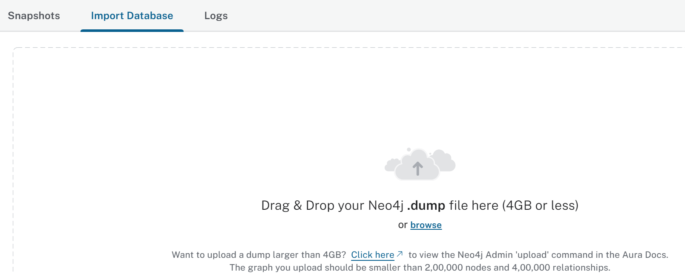
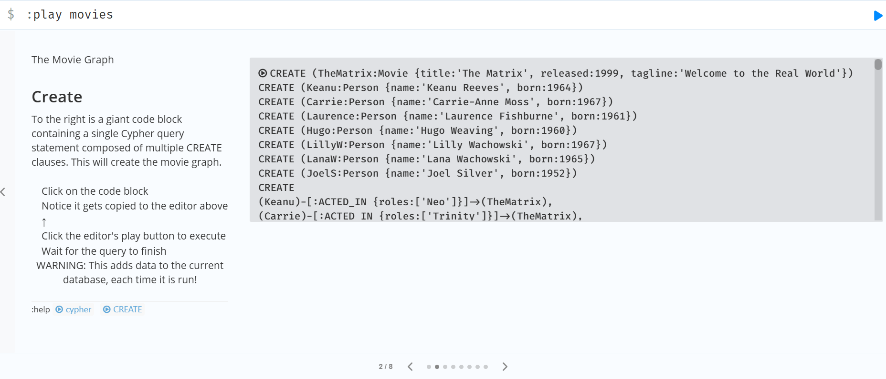

# Querying Knowledge Graphs

## Notebook

- [Jupyter Notebook](../code/L2-query_with_cypher.ipynb)

### Database Setup

- Steps added to run the notebook locally:
  - **Neo4j Environment Setup**
    - As mentioned in [Neo4j developer blog](https://neo4j.com/developer-blog/knowledge-graph-rag-application/)'s **Neo4j Environment Setup** section, there are two options:
      - Start a free cloud instance of the Neo4j database on Neo4j Aura
      - Local instance of the Neo4j database using Neo4j Desktop
    - I have utilized Neo4j database on Neo4j Aura
      - [Default database](https://neo4j.com/docs/cypher-manual/current/introduction/cypher_neo4j/#built-in-databases): `neo4j`
    - Populate the environment variables in [.env file](../code/.env) as defined in your Neo4j Aura account.
  - **Populating Movies database**
    - Option #1
      - [Import database](https://neo4j.com/docs/aura/auradb/importing/import-database/) using the .dump file
        - Clicking on the instance in the Neo4j Aura Console would take you to the following screen:
        - 
        - Upload [neo4j_L2.dump file](../code/data/neo4j_L2.dump)
    - Option #2
      - I followed the CREATE step of the hosted movies database as mentioned in the [Getting Started docs](https://neo4j.com/docs/getting-started/appendix/example-data/#_hosted_databases).
        
      - On the built-in Browser guide, run the command `:PLAY movies` as suggested in the [developer blog](https://neo4j.com/developer-blog/getting-started-with-play-movies/). You will find the CREATE step in it.
    - Movies database: 
