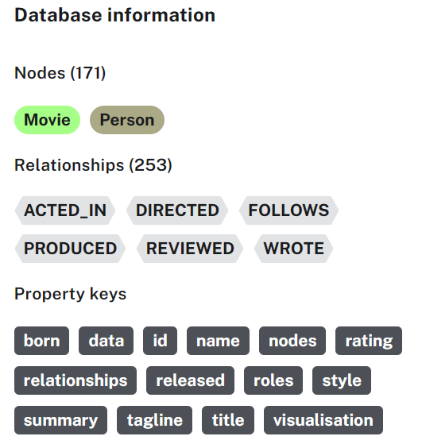

# Querying Knowledge Graphs

## Notebook

- [Jupyter Notebook](../code/L2-query_with_cypher.ipynb)

### Database Setup

- Steps added to run the notebook locally:
  - **Neo4j Environment Setup**
    - Utilized the free cloud based Neo4j database on Neo4j Aura as suggested in [Neo4j developer blog](https://neo4j.com/developer-blog/knowledge-graph-rag-application/)'s **Neo4j Environment Setup** section.
      - [Default database](https://neo4j.com/docs/cypher-manual/current/introduction/cypher_neo4j/#built-in-databases): `neo4j`
    - Populate the environment variables in [.env file](../code/.env) as defined in your Neo4j Aura account.
  - **Populating Movies database**
    - Followed the CREATE step of the hosted movies database as mentioned in the [Getting Started docs](https://neo4j.com/docs/getting-started/appendix/example-data/#_hosted_databases).
    - On the built-in Browser guide, run the command `:PLAY movies` as suggested in the [developer blog](https://neo4j.com/developer-blog/getting-started-with-play-movies/). You will find the CREATE step in it.
    - Movies database: 
