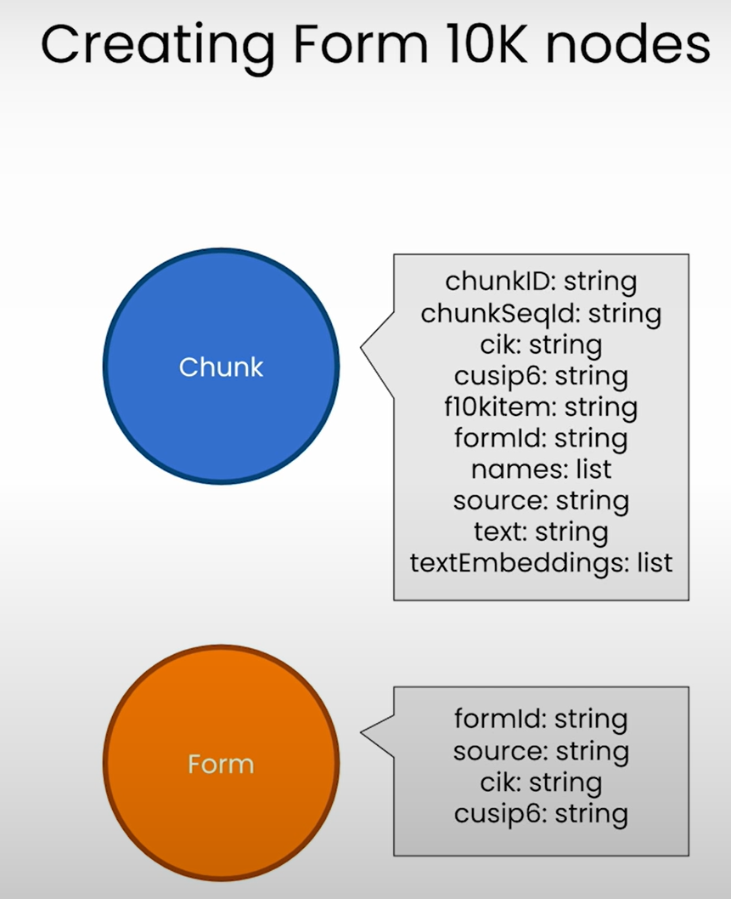
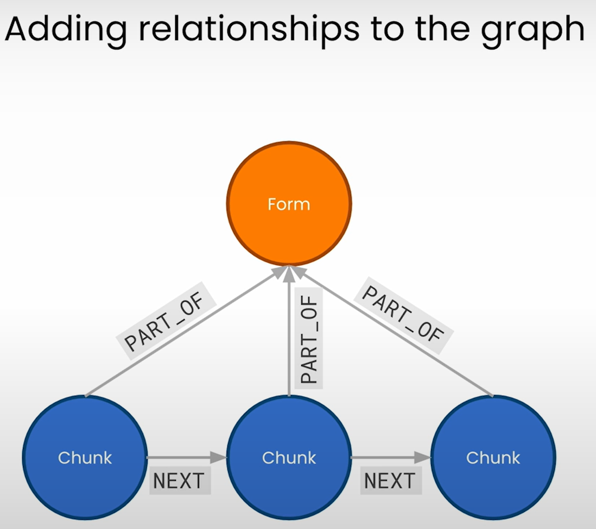

# Adding Relationships to the SEC Knowledge Graph

## Creating Form 10K nodes

- Each of the chunks has the information that we need to create the form node.
- 

## Adding relationships to the graph

- Goal: Add relationships to improve the context around each chunk.
- 
- We can create linked list of all chunks belonging to a section.
- Another relationship: Connecting the form to the first chunk of each section.
  - This will enable to easily navigate from the form to the beginning of a particular section.

## Neo4j documentation

- [Neo4j Vector Index](https://python.langchain.com/v0.1/docs/integrations/vectorstores/neo4jvector/): `Neo4jVector`
- [Neo4j x LangChain: Deep Dive Into the New Vector Index Implementation](https://neo4j.com/developer-blog/neo4j-langchain-vector-index-implementation/)
  - The `retrieval_query` parameter allows you to collect, transform, or calculate any additional graph information you want to return from the similarity search.

## Notebook

- [Jupyter Notebook](../code/L5-add_relationships_to_kg.ipynb)
- Observation:
  - Default retrieval is from a single chunk. For window query, context is expanded with adjacent chunks.
  - This is reflected in the answer to the query on Netapp's ransomware protection. Window query expands the context by mentioning [NetApp's ONTAP data management software](https://www.netapp.com/blog/gigaom-highlights-netapp-leader-file-storage/).
