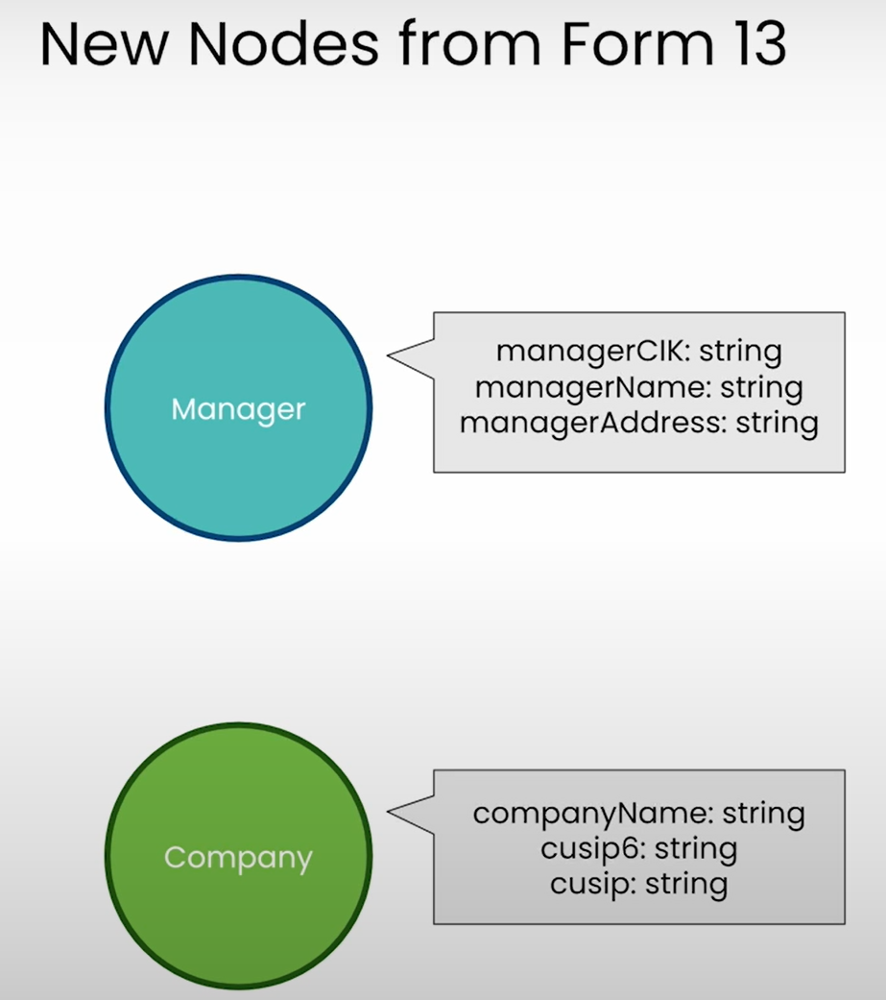
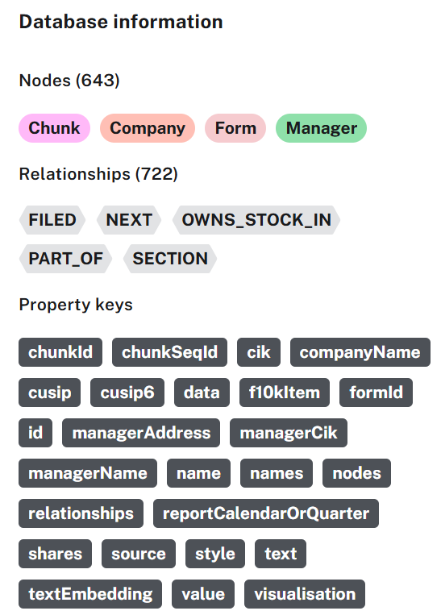

# Expanding the SEC Knowledge Graph

- Add second set of forms to provide information about institutional investment managers and the interests they hold in companies.
- The two set of forms helps in understanding market dynamics.
- Form 13 is filed by institutional management firms to inform the companies they have invested in.
- 
- `FULLTEXT INDEX`: Enables keyword search

## Neo4j documentation

- [Merge single node specifying both label and property](https://neo4j.com/docs/cypher-manual/current/clauses/merge/#merge-merge-single-node-specifying-both-label-and-property)
  - This is observed in the notebook section "Create manager nodes"
  - ?? If property `managerCik` is mentioned in `MERGE` command, is it required to add uniqueness constraint later?
    - As per [MERGE documentation](https://neo4j.com/docs/cypher-manual/current/clauses/merge/#query-merge-introduction):
      > Under concurrent updates, `MERGE` only guarantees the existence of the `MERGE` pattern, but not uniqueness. To guarantee uniqueness of nodes with certain properties, a property uniqueness constraint should be used.
- [Full-text indexes](https://neo4j.com/docs/cypher-manual/current/indexes/semantic-indexes/full-text-indexes/)

## Notebook

- [Jupyter Notebook](../code/L6-expand_the_kg.ipynb)
- ?? Why pass property in relationship for `MERGE` instead of `ON CREATE SET`?
- In `investment_retrieval_query`, investment management firms investment is prepended to the text returned by vector search.
- 
