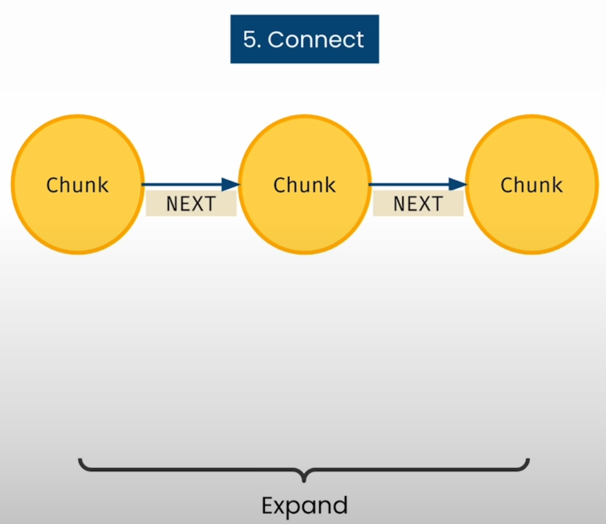

# Chatting with the SEC Knowledge Graph

## How did you create a knowledge graph

- Start with a Minimum Viable Graph (MVG), then
  - **Extract**: Identify interesting information that we want to pull out into separate nodes
    
  - **Enhance**: Supercharge the data with e.g. vector embedding
    
  - **Expand**: Connect information to expand context i.e. connecting the data to the graph that you already have
    

- Extract, Enhance, Expand with SEC forms
  

- Growing the knowledge graph can be continued by
  - Cross-linking the companies that mention each other e.g. suppliers
  - Add People, Place, Topics extracted from text
  - Add more Form data, or other related sources
  - Add Users to refine relevance and enable feedback

## Address Nodes

- We will expand the knowledge graph by including address nodes
  
- Resulting Knowledge Graph
  
- Ask location questions, e.g.
  - What companies are near each other?
- Exploring the knowledge graph a bit more
  - Cypher queries to directly explore the graph
  - Use LangChain to create a Question & Answer chat
  - Finally, use LLM to combine both of these techniques in a fun new way.

- For GeoSpatial search, cartesian distance is utilized instead of cosine similarity which is used for vector search.
- For notebook
  - point distance: 10k is in meters
  - Mis-spelt "Palo Aalto" in full text search

## Generate Cypher statement

- LangChain functionalities used
  - PromptTemplate
  - GraphCypherQAChain
- ?? In the example provided, isn't looking for answer in only 1st chunk of section insufficient?

## Neo4j Documentation

- Full text search
  - [Query full-text index](https://neo4j.com/docs/cypher-manual/current/indexes/semantic-indexes/full-text-indexes/#query-full-text-indexes)
    - `db.index.fulltext.queryNodes`
    - Requires `indexName` which can be identified by [listing all full-text indexes](https://neo4j.com/docs/cypher-manual/current/indexes/semantic-indexes/full-text-indexes/#show-full-text-indexes).
- [count()](https://neo4j.com/docs/cypher-manual/current/functions/aggregating/#functions-count)

## Notebook

- [Jupyter Notebook](../code/L7-chat_with_kg.ipynb)
- Database setup
  - Load [neo4j dump](../code/data/neo4j_L7.dump) as explained in [option #1](./Lesson_2.md#database-setup).
- Observation: Even though both `Company` and `Manager` nodes have `location` field, but we have considered their relationship with `Address` node and picked `location` from the `Address` node.
- ?? The query added in the section **Expand the query to retrieve information from the Form 10K chunks** would answer only from the text of 1st chunk of the section as mentioned in [Lesson #5 notebook](Lesson_5.md#notebook) section: **Create a SECTION relationship on first chunk of each section**. I feel the query needs to be changed to include all the text chunks.
- **Hallucination**:
  - Initially for the query on total investment by a management firm, GraphCypherQAChain created query by summing over non-existent `value` field in `Company`, inspite of being instructed to stick to the schema. Instead the sum should be over `value` field present in the relationship `OWNS_STOCK_IN`.
  - On providing an example in the prompt, this error got rectified.
